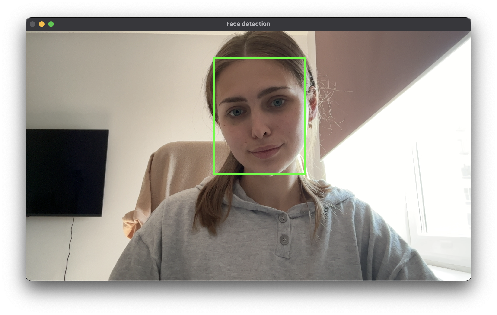

### Лабораторная работа 8. Распознование лиц по изображению с камеры

1) Импорт библиотеки OpenCV

```python
import cv2
```

2) Захват изображения с камеры

```python
video = cv2.VideoCapture(0)
```

3) Получение изображения до нажатия какой-либо клавиши

```python
while cv2.waitKey(1) < 0:
		hasFrame, frame = video.read()
		if not hasFrame:
        cv2.waitKey()
        break

		cv2.imshow("Face detection", resultImg)

```

4) Загрузка файлов весов и параметров модели. Создание модели

```python
faceProto = "opencv_face_detector.pbtxt"
faceModel = "opencv_face_detector_uint8.pb"
```

5) Создание нейросети

```python
faceNet = cv2.dnn.readNet(faceModel, faceProto)
```

6) Создание функции `highlite_face`, которая в параметрах получает сам кадр и порог уверенности `conf_threshold`

```python
def highlightFace(net, frame, conf_threshold=0.6):
    frameOpencvDnn = frame.copy() # создаем копию изображения с 
																				#камеры/изображение из файла
    frameHeight = frameOpencvDnn.shape[0]
    frameWidth = frameOpencvDnn.shape[1]

		# создаем бинарный объект
		blob = cv2.dnn.blobFromImage(frameOpencvDnn, 1.0, (300, 300), 
																		[104, 117, 123], True, False)

		net.setInput(blob) #передаем его нейросети

```

7) Перебор потенциальных областей, определение границ (координат) изображения (лица)

```python
detections = net.forward()
    faceBoxes = []

    for i in range(detections.shape[2]):
        confidence = detections[0, 0, i, 2]
        if confidence > conf_threshold:
            x1 = int(detections[0, 0, i, 3] * frameWidth)
            y1 = int(detections[0, 0, i, 4] * frameHeight)
            x2 = int(detections[0, 0, i, 5] * frameWidth)
            y2 = int(detections[0, 0, i, 6] * frameHeight)
            faceBoxes.append([x1, y1, x2, y2])
            cv2.rectangle(frameOpencvDnn, (x1, y1), (x2, y2), (0, 255, 0), int(round(frameHeight / 150)), 8)
    
return frameOpencvDnn, faceBoxes

resultImg, faceBoxes = highlightFace(faceNet, frame)
```


### Результаты:




