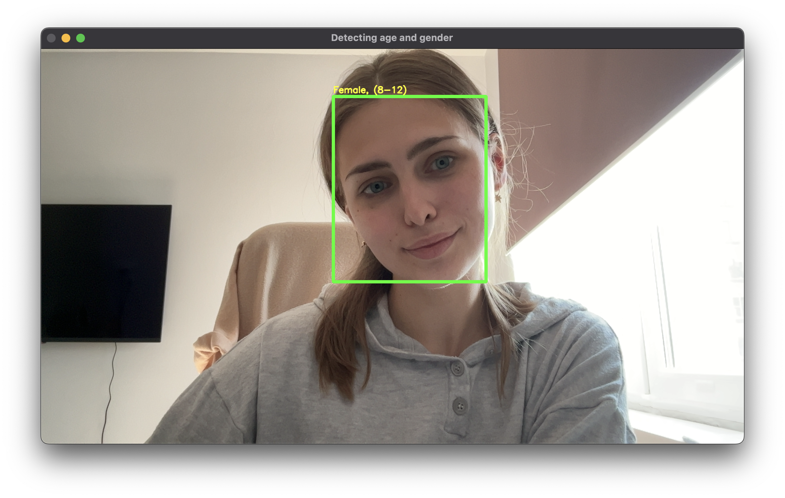
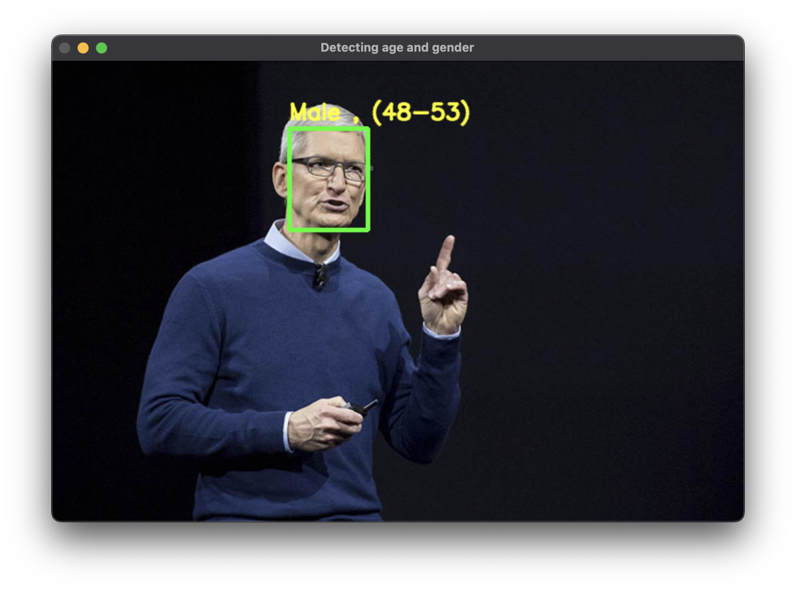
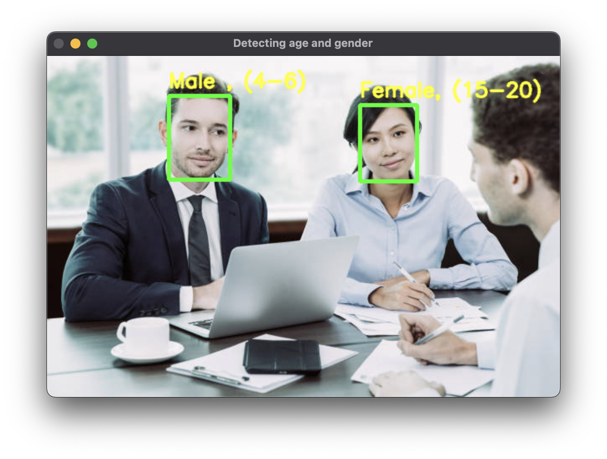

### Лабораторная работа 9. Определение пола и возраста

0. Настройка света, границ возрасто, варианты пола, загрузка файлов 
весов и моделей

```python
MODEL_MEAN_VALUES = (78.4263377603, 87.7689143744, 114.895847746)

genderList = ['Male ', 'Female']
ageList = ['(0-2)', '(4-6)', '(8-12)', '(15-20)', '(25-32)', '(38-43)', '(48-53)', '(60-100)']

genderProto = "gender_deploy.prototxt"
genderModel = "gender_net.caffemodel"
ageProto = "age_deploy.prototxt"
ageModel = "age_net.caffemodel"
```

1. Функция `detect_age_gende`, определяющия пол и возраст

```python
def detect_age_gender(blob):
    genderNet.setInput(blob)
    genderPreds = genderNet.forward()
    gender = genderList[genderPreds[0].argmax()]
    print(f'Gender: {gender}')

    ageNet.setInput(blob)
    agePreds = ageNet.forward()
    age = ageList[agePreds[0].argmax()]
    print(f'Age: {age[1:-1]} years')
    return [age, gender]
```

2. Создание нейросети

```python
    genderNet = cv2.dnn.readNet(genderModel, genderProto)
    ageNet = cv2.dnn.readNet(ageModel, ageProto)
```

3. Функция `image_face_detection` - определение возраста и пола по изображению

```python
def image_face_detection(image_path):
    frame = cv2.imread(image_path)
    if frame is not None:
        resultImg, faceBoxes = highlightFace(faceNet, frame)
        for faceBox in faceBoxes:
            face = frame[max(0, faceBox[1]):
                         min(faceBox[3], frame.shape[0] - 1), max(0, faceBox[0]):min(faceBox[2], frame.shape[1] - 1)]
            blob = cv2.dnn.blobFromImage(face, 1.0, (227, 227), MODEL_MEAN_VALUES, swapRB=False)
            age, gender = detect_age_gender(blob)
            cv2.putText(resultImg, f'{gender}, {age}', (faceBox[0], faceBox[1] - 10), cv2.FONT_HERSHEY_SIMPLEX, 0.8,
                        (0, 255, 255), 2, cv2.LINE_AA)
        cv2.imshow("Detecting age and gender", resultImg)
        cv2.waitKey(0)
        cv2.destroyAllWindows()
    else:
        print('Failed to load image')
```

4, Функция `video_face_detection` - определение возраста и пола по изображению с камеры
```python
def video_face_detection():
    video = cv2.VideoCapture(0)
    while cv2.waitKey(1) < 0:
        hasFrame, frame = video.read()
        resultImg, faceBoxes = highlightFace(faceNet, frame)
        if faceBoxes:
            for faceBox in faceBoxes:
                face = frame[max(0, faceBox[1]):
                             min(faceBox[3], frame.shape[0] - 1), max(0, faceBox[0])
                                                                  :min(faceBox[2], frame.shape[1] - 1)]
            blob = cv2.dnn.blobFromImage(face, 1.0, (227, 227), MODEL_MEAN_VALUES, swapRB=False)
            age, gender = detect_age_gender(blob)
            cv2.putText(resultImg, f'{gender}, {age}', (faceBox[0], faceBox[1] - 10), cv2.FONT_HERSHEY_SIMPLEX, 0.8,
                        (0, 255, 255), 2, cv2.LINE_AA)
            cv2.imshow("Detecting age and gender", resultImg)
            if not hasFrame:
                cv2.waitKey()
                break
            resultImg, faceBoxes = highlightFace(faceNet, frame)
            #cv2.imshow("Face detection", resultImg)
        else:
            print("Лица не распознаны")

```

### Результаты:





